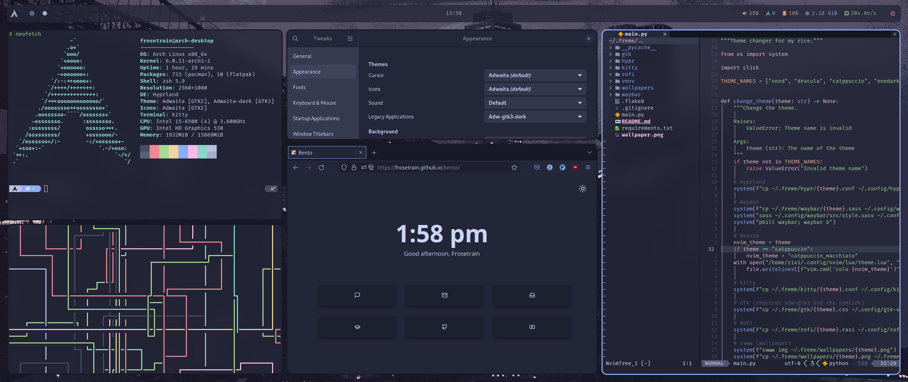

# Frosetrain's Dotfiles

These are the dotfiles for my Arch rice.

## Stuff

* Distro: [Arch Linux](https://archlinux.org)
* Wayland Compositor: Hyprland
* Terminal: Kitty
* Bar: Waybar
* Launcher: Rofi (Ibonn's fork) with config from [adi1090x](https://github.com/adi1090x/rofi)

Includes a theme switcher script (idk why it's called freme) to switch between Nord, Dracula, One Dark and Catppuccin (Macchiato).
